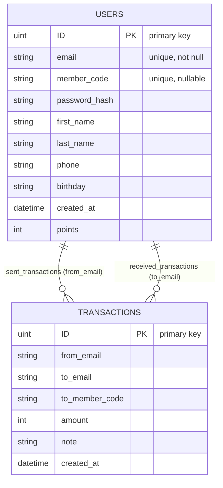

# Database ER Diagram

The diagram below describes the database models discovered in `internal/repository/user_repo.go` and their relationships.

Notes
- The repository stores `User` records and `Transaction` records. Transactions link to users by email (fields `from_email` and `to_email`) and optionally include `to_member_code` for member-code based lookups.
- In GORM this is implemented in `internal/repository/user_repo.go` where `Transaction` and `User` are separate tables; foreign-key constraints are not explicitly declared in the current code — relationships are enforced/queried by application logic (email/member_code lookups).

Reference
- Mermaid ER syntax: https://mermaid.js.org/syntax/entityRelationshipDiagram.html
